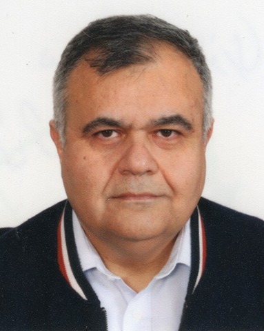

 

# Behzad Nouri, PhD - ECE, PEng, MIEEE
**Siemens EDA Chair and Associate Professor,**\
**Electrical and Computer Engineering**\
**Office 3B56, Engineering Building**,\
*57 Campus Drive, Saskatoon, SK, S7N 5A9*\
**Email:** nouri(at)usask(dot)ca,\
**Tel:** (306) 9661677

---

---

## About Me
Behzad Nouri is an Associate Professor and the Siemens EDA Chair in Electronic Design Automation at the University of Saskatchewan. He received his M.Sc. and Ph.D. degrees in Electrical and Computer Engineering, with a research focus in Electronic Design Automation, from Carleton University in 2008 and 2014. His professional background includes research and development roles at Cadence Design Systems and Siemens EDA, as well as nearly a decade of academic research at Carleton University as a Postdoctoral Research Associate and Adjunct Research Professor. 

His recognitions include the University Gold Medal for his doctoral work, the IEEE Transactions CPMT Best Paper Award, and multiple Best Paper Awards from the IEEE Workshop on Signal and Power Integrity. He is a registered Professional Engineer (P.Eng.).

His research interests include numerical algorithms for circuit and system simulation, signal and power integrity, model order reduction, data-driven macromodeling of RF and optical systems, uncertainty quantification, and computational science. He has authored more than 32 refereed publications, serves on multiple IEEE technical program committees, and is an active reviewer for several IEEE Transactions.

---

## Classes
* Computer-Aided Design of Circuits and Systems -- Undergrad
* Advanced Methods for Simulation of Large-Scale Circuits and Systems -- Grad
* Simulation of High-Speed Interconnects and Vector-Fitting -- Grad
* Advanced EDA Algorithms for Deep-Nanometer Circuit Simulation (EE898, Grad) -- 2026 Winter
* Advanced EDA Algorithms for Circuit Simulation (CME485, Undergard) -- 2027 Winter

---

## Publications
* To be added.

---
### Formulation of Circuit Equations:
#### Lecture Videos by Professor Roni Khzaka (McGill Univ.)
* Introduction to Modified Nodal Analysis:  [YouTube Video -1](https://youtu.be/BPapfxzwsmI?si=rvXkGTpNM_lfbeu8)
* MNA stamps for 
    * Resistors and current sources:      [YouTube Video-2](https://youtu.be/Eh3KzhcnpWw?si=OuoDdhKfUCpr6blq)
    * Capacitors and Inductors:           [YouTube Video-3](https://youtu.be/3TzH7VEq9jQ?si=jihGwStnkvvDt_C4)
    * Voltage Sources and Short Circuits: [YouTube Video-4](https://youtu.be/bP6SPIpx8cw?si=_8L2X3yCniQ4Gxsz)
    * Voltage-Controlled Current Sources: [YouTube Video-5](https://youtu.be/90FGQb4Y6-M?si=ZmSgEk5kj0NMNmMM)
    * Voltage-Controlled Voltage Sources: [YouTube Video-6](https://youtu.be/5Zkl7iO5V18?si=Yz_-CjSX-QENxFuU)
    * Current Controlled Current Sources: [YouTube Video-7](https://youtu.be/F2C0sqb7fZ0?si=if57b72u_lUeN11Y)
    * Current Controlled Current Sources (cont'd): [YouTube Video-8](https://youtu.be/hZnnVO0e0TY?si=fs52v_qZ9IRh7d-q)
    * Current Controlled Voltage Sources: [YouTube Video-9](https://youtu.be/vYEqv-bJnWA?si=NlFROU6nKN4_1_Gg)
    * Current Controlled Voltage Sources: [YouTube Video-10](https://youtu.be/A2lFVxuOrJA?si=9v0zNpaLZ31YAlae)
    * Nonlinear Resistors, Capacitors and Inductors: [YouTube Video-11](https://youtu.be/Ys8az800pUs?si=3b1D8HeYbBKV4ngL)

**Courtesy Note:** These videos were seamlessly prepared by my good friend and knowledgeable colleague, Professor Roni Khazaka. Since we both trained under the same supervisor at Carleton University's EDA lab, you might spot some familiar similarities in our teaching styles and core concepts!

---
### Recommended Readings

**Achar, R., and M. S. Nakhla.**, “Simulation of High-Speed Interconnects.” *Proceedings of the IEEE*, vol. 89, no. 5, May 2001, pp. 693–728. DOI: [10.1109/5.929650](https://doi.org/10.1109/5.929650)   
**Paper:** [achar_2001_simulation_of_high-speed_interconnects](./achar_2001_simulation_of_high-speed_interconnects.pdf)

**Odabasioglu, A., et al.**, "PRIMA: Passive Reduced-Order Interconnect Macromodeling Algorithm.", *IEEE Transactions on Computer-Aided Design of Integrated Circuits and Systems*, vol. 17, no. 8, Aug. 1998, pp. 645–54. DOI: [10.1109/43.712097](https://doi.org/10.1109/43.712097)   
**Paper:** [odabasioglu_1998_prima](./odabasioglu_1998_prima.pdf)

---
## Useful Links & Resources:

### LaTeX Guides & Tools
LaTeX is a document preparation system designed for high-quality typesetting, most often used for technical or scientific documents. 
* **Online Compiler:** [Overleaf](https://www.overleaf.com/)
* **Local Installation:** [Get LaTeX](https://www.latex-project.org/get/)
* **Learning Resources:**
    * [Five-minute guide to LaTeX](docs/FiveMinuteGuideToLaTeX.pdf)
    * [The Not So Short Introduction to LaTeX](docs/lshort.pdf)
    * [LaTeX-Wikibooks](https://en.wikibooks.org/wiki/LaTeX)
    * [LaTeX cheat sheet](https://www.nyu.edu/projects/beber/files/Chang_LaTeX_sheet.pdf)
    * [Comprehensive LaTeX Symbol List](http://tug.ctan.org/info/symbols/comprehensive/symbols-a4.pdf)

### Research Methodologies
* **How to Write a Research Paper:** [YouTube Video](https://www.youtube.com/watch?v=sSnxXQgUCyY&feature=youtu.be)
